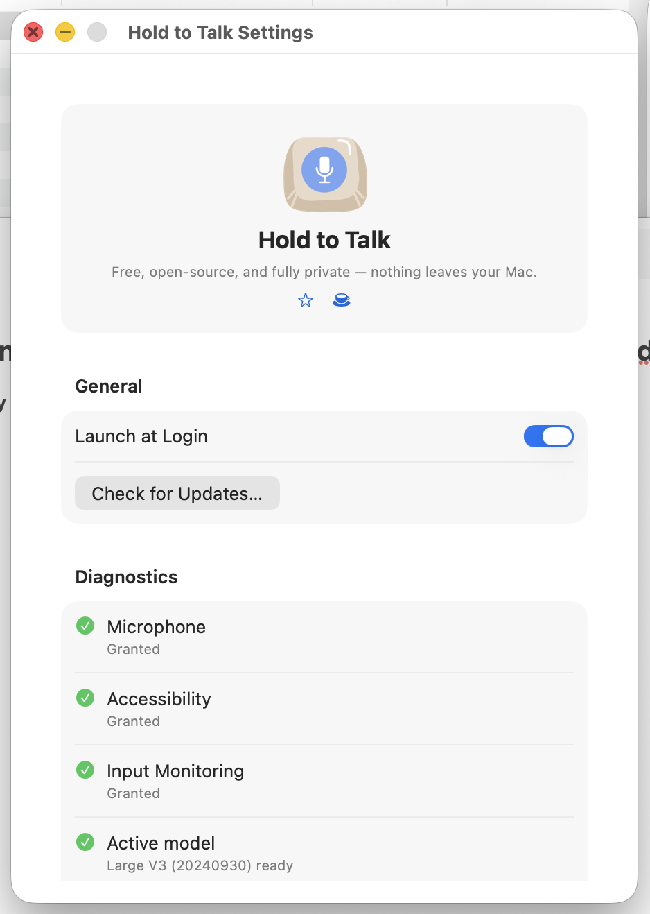

<p align="center">
  
</p>

# Hold to Talk

Free, open-source voice dictation for macOS. Hold a key, speak, release — your words appear wherever your cursor is. Nothing ever leaves your Mac.

- **Fully private** — powered by [WhisperKit](https://github.com/argmaxinc/WhisperKit), transcription runs entirely on Apple Silicon via Core ML. No cloud, no accounts, no network calls.
- **Works everywhere** — dictate into any app: Slack, Notes, your IDE, email, browser — anywhere you can type.
- **Apple Intelligence cleanup** (optional) — on-device grammar and filler-word removal. Customizable prompt. Requires macOS 26+.
- **Stays out of your way** — lives in your menu bar. Hold a key to record, release to paste. That's it.

<p align="center">
  
</p>

## Install

**Requirements:** macOS 15+, Apple Silicon.

### Download pre-built binary

Grab the latest `.app` from [GitHub Releases](https://github.com/jxucoder/holdtotalk/releases), move it to `/Applications`, and open it. macOS will prompt for Microphone and Accessibility permissions on first launch.

### Homebrew

```bash
brew install jxucoder/tap/holdtotalk
```

### Build from source

Requires Xcode command line tools.

```bash
git clone https://github.com/jxucoder/holdtotalk.git
cd holdtotalk
make build
make run
```

Or open `Package.swift` in Xcode and run.

## Usage

1. Launch — appears in menu bar as a mic icon
2. Hold **Ctrl** (default) to record
3. Release to transcribe and paste into the active window
4. Click the menu bar icon for status, last transcription, and settings

### Settings

Open via menu bar → Settings:

| Setting | Default | Options |
|---|---|---|
| Launch at Login | off | Toggle on/off |
| Whisper model | `large-v3-turbo` | `tiny.en`, `tiny`, `base.en`, `base`, `small.en`, `small`, `medium.en`, `medium`, `large-v3-turbo`, `large-v3` |
| Hotkey | `ctrl` | `ctrl`, `option`, `shift`, `fn`, `right_option` |
| Cleanup | on | Toggle on/off — uses Apple Intelligence (macOS 26+) |
| Cleanup prompt | (default) | Customizable instructions for how Apple Intelligence cleans up transcriptions |

## Architecture

```
HoldToTalkApp          SwiftUI menu bar app, entry point
DictationEngine        Orchestrator: record → transcribe → cleanup → paste
AudioRecorder          AVAudioEngine mic capture, resamples to 16 kHz mono
Transcriber            WhisperKit wrapper, lazy model loading
TextProcessor          On-device text cleanup via Apple Intelligence
TextInserter           Multi-strategy text insertion (Accessibility API, keyboard events, clipboard)
HotkeyManager          NSEvent global/local monitor for modifier keys
ModelManager           Whisper model download and lifecycle management
RecordingHUD           Floating overlay showing recording state
OnboardingView         Guided setup flow for first launch
SettingsView           SwiftUI settings form
```

One external dependency: [WhisperKit](https://github.com/argmaxinc/WhisperKit). No network calls — everything runs locally.

## Permissions

macOS will prompt for:
- **Microphone** — required for recording
- **Accessibility** — required for global hotkey and paste simulation

## Contributing

Contributions are welcome! Please open an issue to discuss larger changes before submitting a PR.

1. Fork the repo
2. Create a feature branch (`git checkout -b my-feature`)
3. Commit your changes
4. Open a pull request

## Privacy

Hold to Talk runs entirely on your Mac — no cloud, no accounts, no tracking. See the full [Privacy Policy](PRIVACY.md).

## License

[Apache 2.0](LICENSE)
